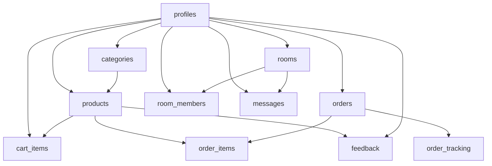

# Supabase Schema Setup Guide

This file provides the complete, production-ready SQL scripts to initialize your Supabase database for the **Karigar** platform. It contains table definitions, foreign key integrity rules, automatic index creations for performance optimization, and Row-Level Security (RLS) policies.

---

## Creation Sequence Flow
To avoid foreign key dependency errors, create the tables in the exact order listed below:



---

## 1. SQL Schema Scripts

### Table 1: `profiles`
Stores master profile records for both buyers and artisans (sellers).
```sql
-- Create table
create table public.profiles (
    id uuid references auth.users on delete cascade primary key,
    full_name text not null,
    role text not null check (role in ('buyer', 'seller')),
    phone_number text,
    profile_pic_url text,
    village text,
    district text,
    state text,
    languages text[] default '{}'::text[],
    bio text,
    created_at timestamp with time zone default timezone('utc'::text, now()) not null
);

-- Enable RLS
alter table public.profiles enable row level security;

-- Policies
create policy "Profiles are viewable by everyone" 
    on public.profiles for select using (true);

create policy "Users can insert their own profile" 
    on public.profiles for insert with check (auth.uid() = id);

create policy "Users can update own profile" 
    on public.profiles for update using (auth.uid() = id);
```

---

### Table 2: `categories`
Craft classification tags used for buyer catalog browsing.
```sql
-- Create table
create table public.categories (
    id uuid default gen_random_uuid() primary key,
    name text not null,
    icon_name text,
    created_at timestamp with time zone default timezone('utc'::text, now()) not null
);

-- Enable RLS
alter table public.categories enable row level security;

-- Policies
create policy "Categories are viewable by everyone" 
    on public.categories for select using (true);
```

---

### Table 3: `products`
Main catalog records showcasing artisan inventory, featuring voice description file links.
```sql
-- Create table
create table public.products (
    id uuid default gen_random_uuid() primary key,
    seller_id uuid references public.profiles(id) on delete cascade not null,
    category_id uuid references public.categories(id) on delete set null,
    title text not null,
    description text,
    voice_description_url text,
    price numeric(10,2) check (price >= 0),
    stock integer default 0 check (stock >= 0),
    image_urls text[] default '{}'::text[],
    is_available boolean default true,
    created_at timestamp with time zone default timezone('utc'::text, now()) not null
);

-- Create Performance Indexes
create index idx_products_seller_id on public.products(seller_id);
create index idx_products_category_id on public.products(category_id);

-- Enable RLS
alter table public.products enable row level security;

-- Policies
create policy "Products are viewable by everyone" 
    on public.products for select using (true);

create policy "Sellers can insert their own products" 
    on public.products for insert with check (
        auth.uid() = seller_id and 
        exists (select 1 from public.profiles where id = auth.uid() and role = 'seller')
    );

create policy "Sellers can update their own products" 
    on public.products for update using (auth.uid() = seller_id);

create policy "Sellers can delete their own products" 
    on public.products for delete using (auth.uid() = seller_id);
```

---

### Table 4: `cart_items`
Temporary buyer cart items storage.
```sql
-- Create table
create table public.cart_items (
    id uuid default gen_random_uuid() primary key,
    buyer_id uuid references public.profiles(id) on delete cascade not null,
    product_id uuid references public.products(id) on delete cascade not null,
    quantity integer default 1 check (quantity > 0),
    created_at timestamp with time zone default timezone('utc'::text, now()) not null
);

-- Create Indexes
create index idx_cart_buyer_id on public.cart_items(buyer_id);

-- Enable RLS
alter table public.cart_items enable row level security;

-- Policies
create policy "Buyers can view their own cart items" 
    on public.cart_items for select using (auth.uid() = buyer_id);

create policy "Buyers can insert items into their own cart" 
    on public.cart_items for insert with check (auth.uid() = buyer_id);

create policy "Buyers can update their own cart items" 
    on public.cart_items for update using (auth.uid() = buyer_id);

create policy "Buyers can delete their own cart items" 
    on public.cart_items for delete using (auth.uid() = buyer_id);
```

---

### Table 5: `orders`
Logs purchase commitments between buyers and artisans.
```sql
-- Create table
create table public.orders (
    id uuid default gen_random_uuid() primary key,
    buyer_id uuid references public.profiles(id) on delete set null,
    seller_id uuid references public.profiles(id) on delete set null,
    total_amount numeric(10,2) not null check (total_amount >= 0),
    order_status text default 'pending' check (order_status in ('pending', 'packed', 'shipped', 'delivered')),
    created_at timestamp with time zone default timezone('utc'::text, now()) not null
);

-- Create Indexes
create index idx_orders_buyer on public.orders(buyer_id);
create index idx_orders_seller on public.orders(seller_id);

-- Enable RLS
alter table public.orders enable row level security;

-- Policies
create policy "Buyers and sellers can view their own orders" 
    on public.orders for select using (auth.uid() = buyer_id or auth.uid() = seller_id);

create policy "Buyers can place orders" 
    on public.orders for insert with check (auth.uid() = buyer_id);

create policy "Involved parties can update order metadata" 
    on public.orders for update using (auth.uid() = buyer_id or auth.uid() = seller_id);
```

---

### Table 6: `order_items`
Granular line-item breakdown inside each order.
```sql
-- Create table
create table public.order_items (
    id uuid default gen_random_uuid() primary key,
    order_id uuid references public.orders(id) on delete cascade not null,
    product_id uuid references public.products(id) on delete set null,
    quantity integer not null check (quantity > 0),
    price numeric(10,2) not null check (price >= 0)
);

-- Create Indexes
create index idx_order_items_order_id on public.order_items(order_id);

-- Enable RLS
alter table public.order_items enable row level security;

-- Policies
create policy "Authorized parties can view order items" 
    on public.order_items for select using (
        exists (
            select 1 from public.orders 
            where orders.id = order_id and (orders.buyer_id = auth.uid() or orders.seller_id = auth.uid())
        )
    );

create policy "Buyers can insert order items" 
    on public.order_items for insert with check (
        exists (
            select 1 from public.orders 
            where orders.id = order_id and orders.buyer_id = auth.uid()
        )
    );
```

---

### Table 7: `feedback`
Platform evaluation metrics for trust-building. Includes voice feedback options.
```sql
-- Create table
create table public.feedback (
    id uuid default gen_random_uuid() primary key,
    buyer_id uuid references public.profiles(id) on delete set null,
    seller_id uuid references public.profiles(id) on delete set null,
    product_id uuid references public.products(id) on delete set null,
    rating integer check (rating between 1 and 5),
    comment text,
    voice_feedback_url text,
    created_at timestamp with time zone default timezone('utc'::text, now()) not null
);

-- Create Indexes
create index idx_feedback_product_id on public.feedback(product_id);
create index idx_feedback_seller_id on public.feedback(seller_id);

-- Enable RLS
alter table public.feedback enable row level security;

-- Policies
create policy "Feedback is publicly readable" 
    on public.feedback for select using (true);

create policy "Buyers can submit feedback" 
    on public.feedback for insert with check (auth.uid() = buyer_id);

create policy "Buyers can update/delete their own feedback" 
    on public.feedback for update using (auth.uid() = buyer_id);
```

---

### Table 8: `rooms`
Forums facilitating community audio/text interactions.
```sql
-- Create table
create table public.rooms (
    id uuid default gen_random_uuid() primary key,
    name text not null,
    description text,
    room_type text default 'voice' check (room_type in ('voice', 'text')),
    created_by uuid references public.profiles(id) on delete set null,
    created_at timestamp with time zone default timezone('utc'::text, now()) not null
);

-- Enable RLS
alter table public.rooms enable row level security;

-- Policies
create policy "Rooms are viewable by all users" 
    on public.rooms for select using (true);

create policy "Authenticated users can create rooms" 
    on public.rooms for insert with check (auth.uid() = created_by);

create policy "Creators can modify/delete rooms" 
    on public.rooms for update using (auth.uid() = created_by);
```

---

### Table 9: `room_members`
Association linking users currently present in dynamic room environments.
```sql
-- Create table
create table public.room_members (
    id uuid default gen_random_uuid() primary key,
    room_id uuid references public.rooms(id) on delete cascade not null,
    user_id uuid references public.profiles(id) on delete cascade not null,
    joined_at timestamp with time zone default timezone('utc'::text, now()) not null,
    unique(room_id, user_id)
);

-- Create Indexes
create index idx_room_members_room_id on public.room_members(room_id);

-- Enable RLS
alter table public.room_members enable row level security;

-- Policies
create policy "Room memberships are readable by everyone" 
    on public.room_members for select using (true);

create policy "Users can join rooms" 
    on public.room_members for insert with check (auth.uid() = user_id);

create policy "Users can leave rooms" 
    on public.room_members for delete using (auth.uid() = user_id);
```

---

### Table 10: `messages`
Dialogue entries containing text or storage links for voice messaging records.
```sql
-- Create table
create table public.messages (
    id uuid default gen_random_uuid() primary key,
    room_id uuid references public.rooms(id) on delete cascade not null,
    sender_id uuid references public.profiles(id) on delete set null,
    message_text text,
    voice_message_url text,
    created_at timestamp with time zone default timezone('utc'::text, now()) not null
);

-- Create Indexes
create index idx_messages_room_id on public.messages(room_id);

-- Enable RLS
alter table public.messages enable row level security;

-- Policies
create policy "Room messages can be read by room members" 
    on public.messages for select using (
        exists (
            select 1 from public.room_members 
            where room_members.room_id = messages.room_id and room_members.user_id = auth.uid()
        )
    );

create policy "Room members can send messages" 
    on public.messages for insert with check (
        auth.uid() = sender_id and
        exists (
            select 1 from public.room_members 
            where room_members.room_id = messages.room_id and room_members.user_id = auth.uid()
        )
    );
```

---

### Table 11: `order_tracking`
Live progression logs for order deliveries.
```sql
-- Create table
create table public.order_tracking (
    id uuid default gen_random_uuid() primary key,
    order_id uuid references public.orders(id) on delete cascade not null,
    status text not null,
    updated_at timestamp with time zone default timezone('utc'::text, now()) not null
);

-- Create Indexes
create index idx_order_tracking_order_id on public.order_tracking(order_id);

-- Enable RLS
alter table public.order_tracking enable row level security;

-- Policies
create policy "Buyers and sellers can track orders" 
    on public.order_tracking for select using (
        exists (
            select 1 from public.orders 
            where orders.id = order_id and (orders.buyer_id = auth.uid() or orders.seller_id = auth.uid())
        )
    );

create policy "Sellers can update tracking info" 
    on public.order_tracking for insert with check (
        exists (
            select 1 from public.orders 
            where orders.id = order_id and orders.seller_id = auth.uid()
        )
    );
```
